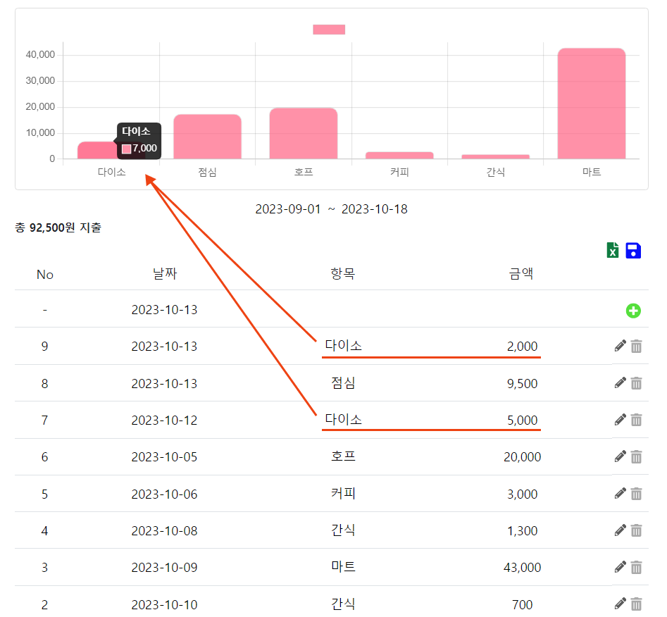
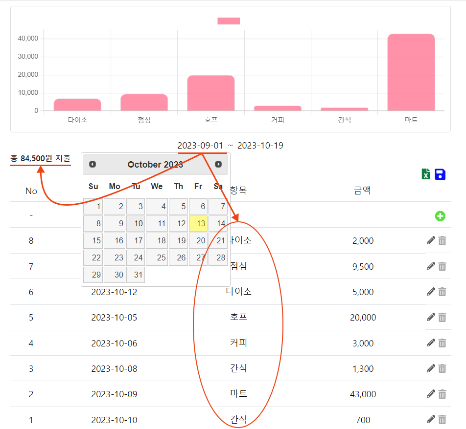
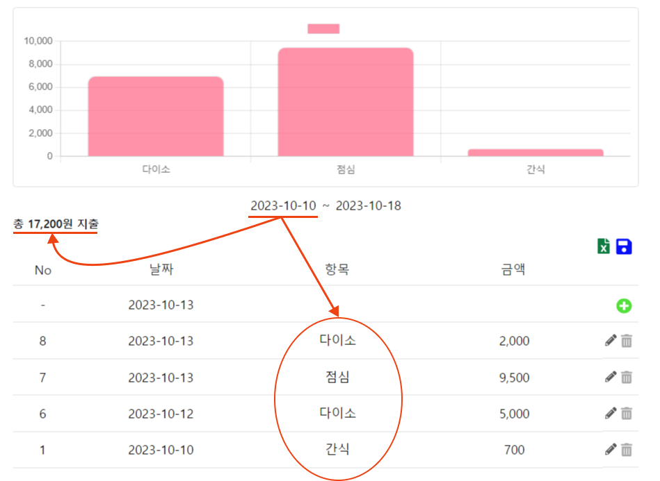
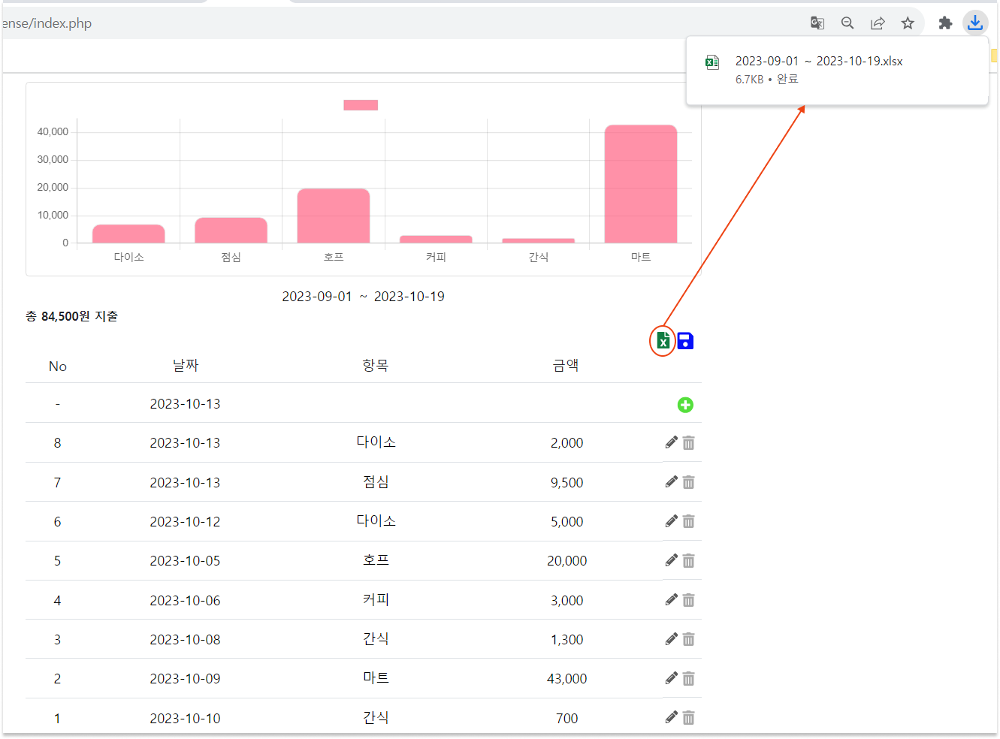
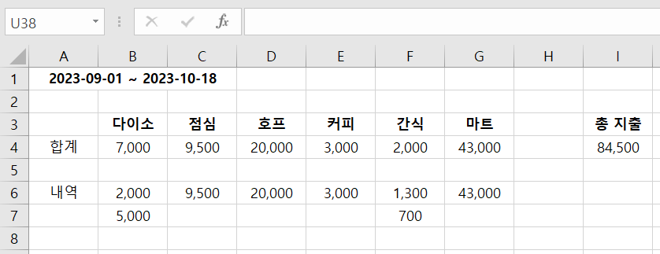

 
 

    

 

    <h3> Expense Tracker</h3>
    
  지출 내역을 쉽고 간편하게 기록하고 

    
 관리하는 웹 애플리케이션 

## 프로젝트 소개

지출 내역을 쉽고 간편하게 기록하고 관리하는 웹 애플리케이션

[Expense Tracker ➡](http://mys.dothome.co.kr/expense/index.php)  

 

## 제작 정보

**제작 기간**

23.08.04 ~

**제작 형태**

개인 프로젝트

**기술 스택**

 
  

 

## 주요 기능

    
 i. 입력한 데이터들중 같은 항목값들은 자동을 계산되어 그래프로 표시. 

     
    
       

 

    
 ii. 원하는 구간을 설정하면 해당 구간에 지출한 내역만 표시.

     
     &nbsp;
    
       

 

    
 iii. 저장한 데이터를 Excel 파일로 다운. 

     
    지정한 구간에 있는 데이터만 엑셀에 정리. 
        
     &nbsp;
    
       

 

### 추가 구현 계획

- 회원가입 및 로그인 기능 추가.

- 버그 및 기능 수정 보완.

- 로고 추가 및 디자인 수정 보완.

- 반응형(모바일에서 사용할 수 있도록).
